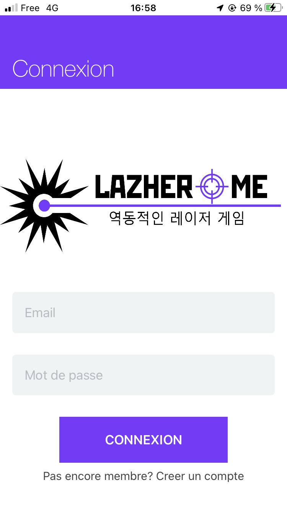

# LazherMe - Application iOS
## Description
Cette application est développée dans le cadre d'un projet technique concernant un laser game portatif.
<p align="center">
  
  
  
  
</p>

## Fonctionnalités

- [x] Inscription
- [x] Connexion
- [x] Creation de partie
- [ ] Rejoindre partie
- [x] Affichage profil
- [x] Scan Bluetooth
- [ ] Connexion Bluetooth
- [x] Deconnexion

## Versions

- iOS 12.0+
- Xcode 13.3

## Installation

#### CocoaPods

Vous pouvez utiliser [CocoaPods](http://cocoapods.org/) pour installer les librairies en les ajoutant au fichier `Podfile`:

```ruby
platform :ios, '15.3

use_frameworks!

pod 'Firebase/Core'
pod 'Firebase/Auth'
pod 'Firebase/Database'

```
